  
  
  
  
  
  

  

# 🚀 Awesome Data Versioning Platform Ecosystem

> **A curated, comprehensive guide to top SaaS platforms & open-source projects for Data Versioning, Git-for-Data, Data Lake Branching, Model Registries & Reproducible MLOps.**

---

## 📌 Executive Overview & Market Context

Data versioning allows data scientists, ML engineers, and enterprise platform teams to version datasets, database tables, and machine learning models with standard software git semantics—enabling zero-copy branching, time-travel queries, atomic commits, and auditability.

* **Open-Source Standardization & Consolidation**: The data versioning landscape has entered a production-proven era. Notably, **lakeFS** (Treeverse) acquired the **DVC** team in November 2025, bringing object-storage data lake branching and file-based ML pipeline tracking under one roof. Tools like **Dolt** (row-level database Git), **Nessie** (Iceberg catalog branching), and **MLflow** (model registry & tracking) form the foundation of modern reproducible AI pipelines.

---

## 📑 Table of Contents

- [☁️ SaaS / Hosted Data Versioning Platforms](#-saas--hosted-data-versioning-platforms)
- [🔓 Open-Source Data Versioning Projects](#-open-source-data-versioning-projects)
- [🤝 How to Contribute](#-how-to-contribute)
- [💖 Support & Community](#-support--community)
- [📈 Star History](#-star-history)
- [📜 Disclaimer](#-disclaimer)

---

## ☁️ SaaS / Hosted Data Versioning Platforms

📊 **Market Intelligence & Dynamics**: The global Data Versioning and MLOps sector is estimated at **~$4.2 Billion in 2026** (projected to reach **$16.5 Billion by 2030** at a ~31% CAGR). The market is currently **moderately fragmented**, with active strategic consolidation (e.g., lakeFS acquiring DVC, HPE acquiring Pachyderm) standardizing data lake control planes and model lifecycle tracking.

The table below summarizes leading managed SaaS solutions, sorted by **Company Scale & Valuation (Descending)**:

| 🏢 Platform / SaaS Product | 📈 Scale & Valuation | 💰 Starting Tier Price | 🎁 Free Tier / Trial Limit |
| :--- | :--- | :--- | :--- |
| **[Pachyderm (HPE MLDM)](https://www.pachyderm.com/)**   Data versioning and automated pipeline orchestration engine for Kubernetes. | **$28.5 Billion Revenue**  *(Parent HPE; acquired 2023)* | **$1,000 / month**  *(Contact HPE Sales for Enterprise)* | **14-day Enterprise Free Trial**  *(Self-hosted Community Edition is free)* |
| **[Weights & Biases Artifacts](https://wandb.ai/)**   Enterprise ML artifact, dataset, and model lineage tracking within W&B platform. | **$1.25 Billion Valuation**  *(~$50M+ ARR)* | **$60 / user / month**  *(Pro Plan)* | **5 GB Storage & 1 GB Ingestion/mo**  *(Up to 5 team seats)* |
| **[lakeFS Cloud](https://lakefs.io/)**   Managed zero-copy data lake branching, time-travel, and S3-compatible data version control. | **$51 Million Funding**  *(Acquired DVC team Nov 2025)* | **$0.007 / GB / month**  *(Cloud Standard starts $250/mo)* | **15-day Enterprise Cloud Free Trial**  *(Full feature access)* |
| **[Iterative Studio](https://iterative.ai/)**   Cloud experiment tracking and model management platform for DVC & Git. | **$25 Million Funding**  *(Aligned with lakeFS ecosystem)* | **$50 / user / month**  *(Team Plan)* | **5 Team Members & 5 Active Experiments**  *(Free forever)* |
| **[DoltHub](https://www.dolthub.com/)**   Hosted cloud platform for version-controlled, MySQL-compatible SQL databases. | **$21 Million Funding**  *(~$1.5M ARR)* | **$5 / month**  *(Pro Plan for private DBs)* | **100 MB Private Storage Free**  *(Unlimited public databases)* |
| **[ClearML Pro](https://clear.ml/)**   Unified MLOps platform featuring data management, artifact versioning, and tracking. | **$16 Million Funding**  *(~$4.7M ARR)* | **$15 / user / month**  *(Pro Plan + cloud usage)* | **3 Team Users, 100 GB Storage & 1M API Calls/mo** |
| **[DagsHub](https://dagshub.com/)**   Integrated platform connecting Git, DVC, and MLflow for unified dataset/model versioning. | **$3.6 Million Funding**  *(~$1.5M ARR)* | **$99 / user / month**  *(Team Plan billed annually)* | **20 GB DagsHub Storage & 100 Private Experiments**  *(Unlimited public repos)* |

---

## 🔓 Open-Source Data Versioning Projects

Production-proven open-source repositories powering data lakes, relational databases, feature stores, and ML artifacts. 

Sorted by **GitHub Stars_Count (Descending)**:

| 📦 Repository & Project Name | ⭐ GitHub_Stars & Link | 📝 Primary Description & Key Use Cases |
| :--- | :---: | :--- |
| **[MLflow](https://github.com/mlflow/mlflow)**   *(mlflow/mlflow)* |  | **Open-source MLOps platform**. Provides Model Registry, dataset versioning, experiment tracking, and artifact logging. |
| **[Dolt](https://github.com/dolthub/dolt)**   *(dolthub/dolt)* |  | **Git for Data**. MySQL-compatible relational database with native row-level Git semantics (commit, branch, merge, diff). |
| **[DVC (Data Version Control)](https://github.com/iterative/dvc)**   *(iterative/dvc)* |  | **Git-like version control for ML datasets & models**. Manages pointer files in Git with remote cache storage (S3/GCS/Azure). |
| **[Git LFS](https://github.com/git-lfs/git-lfs)**   *(git-lfs/git-lfs)* |  | **Git Large File Storage**. Replaces large binary files (datasets, model weights) with text pointers inside Git repositories. |
| **[Great Expectations](https://github.com/great-expectations/great_expectations)**   *(great-expectations/great_expectations)* |  | **Data quality & validation framework**. Validates, documents, and profiles datasets across pipeline versions. |
| **[Kedro](https://github.com/kedro-org/kedro)**   *(kedro-org/kedro)* |  | **Data science framework**. Creates reproducible, maintainable data pipelines with integrated dataset versioning capabilities. |
| **[Apache Iceberg](https://github.com/apache/iceberg)**   *(apache/iceberg)* |  | **High-performance open table format for huge analytic datasets**. Enables snapshot isolation and table time-travel. |
| **[Delta Lake](https://github.com/delta-io/delta)**   *(delta-io/delta)* |  | **Open-source storage layer**. Brings ACID transactions, data versioning (time travel), and schema enforcement to data lakes. |
| **[Flyte](https://github.com/flyteorg/flyte)**   *(flyteorg/flyte)* |  | **Production-grade data & ML orchestration engine**. Tracks execution provenance, dataset lineage, and typed artifacts. |
| **[Feast](https://github.com/feast-dev/feast)**   *(feast-dev/feast)* |  | **Open-source feature store for ML**. Manages, serves, and versions point-in-time correct features for model training & inference. |
| **[Pachyderm (Community)](https://github.com/pachyderm/pachyderm)**   *(pachyderm/pachyderm)* |  | **Data versioning & data-driven pipelines on Kubernetes**. Offers Git-like data version control with automated lineage tracking. |
| **[lakeFS](https://github.com/treeverse/lakeFS)**   *(treeverse/lakeFS)* |  | **Git-for-data platform for data lakes**. Zero-copy branching, time travel, and atomic commits on S3, GCS, and Azure Blob storage. |
| **[CML (Continuous Machine Learning)](https://github.com/iterative/cml)**   *(iterative/cml)* |  | **Open-source library for CI/CD in ML projects**. Auto-generates metrics & dataset diff reports directly in GitHub/GitLab PRs. |
| **[ModelDB](https://github.com/VertaAI/modeldb)**   *(VertaAI/modeldb)* |  | **Model versioning and metadata management system**. Tracks machine learning models, pipelines, and execution metadata. |
| **[Nessie](https://github.com/projectnessie/nessie)**   *(projectnessie/nessie)* |  | **Transactional catalog for data lakes**. Provides Git-like multi-table branching, tagging, and atomic commits for Apache Iceberg. |
| **[Quilt](https://github.com/quiltdata/quilt)**   *(quiltdata/quilt)* |  | **Data package manager & versioning tool**. Manages AWS S3 data packages with version control, docs, and visualization. |
| **[ChiveSave](https://github.com/CHIVE-AI/chivesave-community-backend)**   *(CHIVE-AI/chivesave-community-backend)* |  | **Self-hosted AI artifact versioning backend**. Built with FastAPI & PostgreSQL for private artifact storage and metadata restore. |

---

## 🤝 How to Contribute

Contributions are warmly welcomed! Please follow these simple guidelines:

1. **Fork** the repository.
2. Add your suggested project/tool to `README.md` maintaining alphabetical or specified sorting order.
3. Ensure description includes key features, starting price/tier (for SaaS), or GitHub repository stargazers link (for Open Source).
4. Submit a **Pull Request** with a descriptive summary of changes.

Check out our awesome ecosystem list collection at [Awesome-Awesome-Awesome](https://github.com/ishandutta2007/Awesome-Awesome-Awesome)!

---

## 💖 Support & Community

If you find this repository helpful, please consider showing your support:

- 🌟 **Star this repository** to help others discover data versioning tools!
- 🔀 **Fork & Share** with your team, ML engineers, and data community.
- 💬 **Join our Discord**: Connect with fellow data professionals on [Discord](https://discord.gg/jc4xtF58Ve).
- ☕ **Sponsor & Buy a Coffee**: Support ongoing open-source curation on [GitHub Sponsors](https://github.com/sponsors/ishandutta2007).

---

## 📈 Star History

---

## 📜 Disclaimer

This list is community-curated for informational and educational purposes. Product details, pricing, and company metrics are accurate based on public data sources as of late 2026. Data versioning software handles critical business data and AI model assets—ensure proper security controls and data governance compliance before enterprise deployment.
